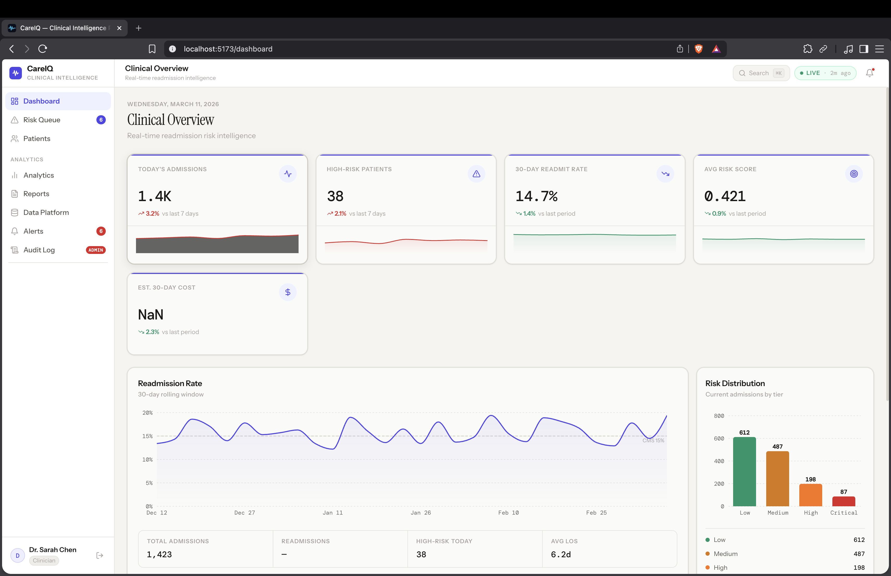
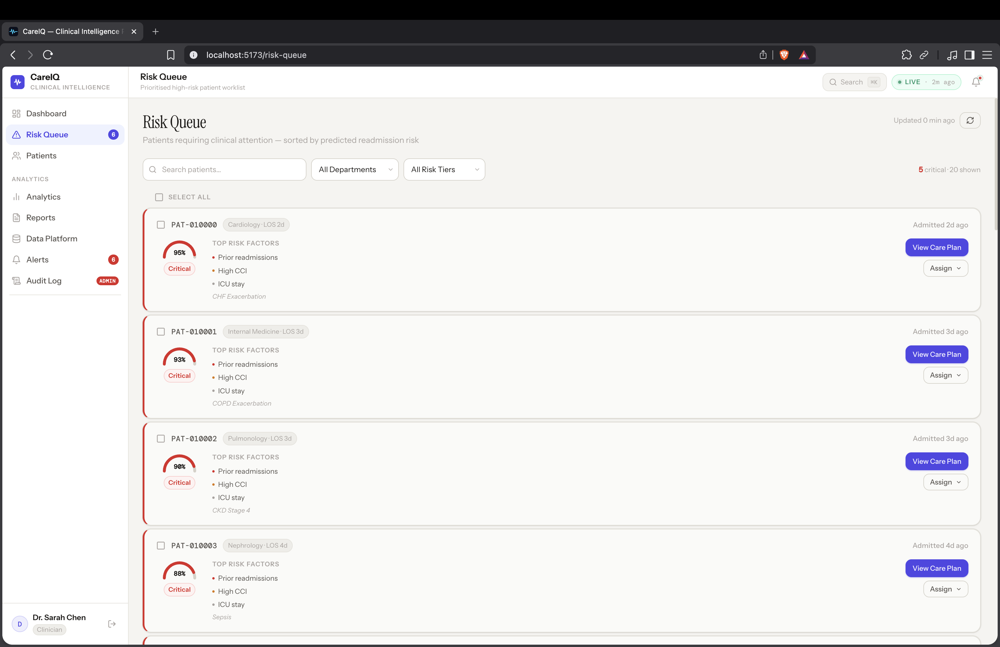
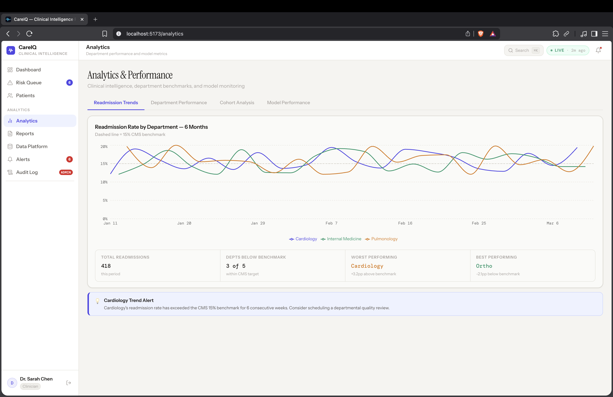
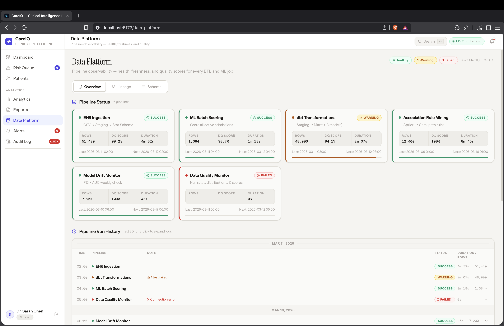
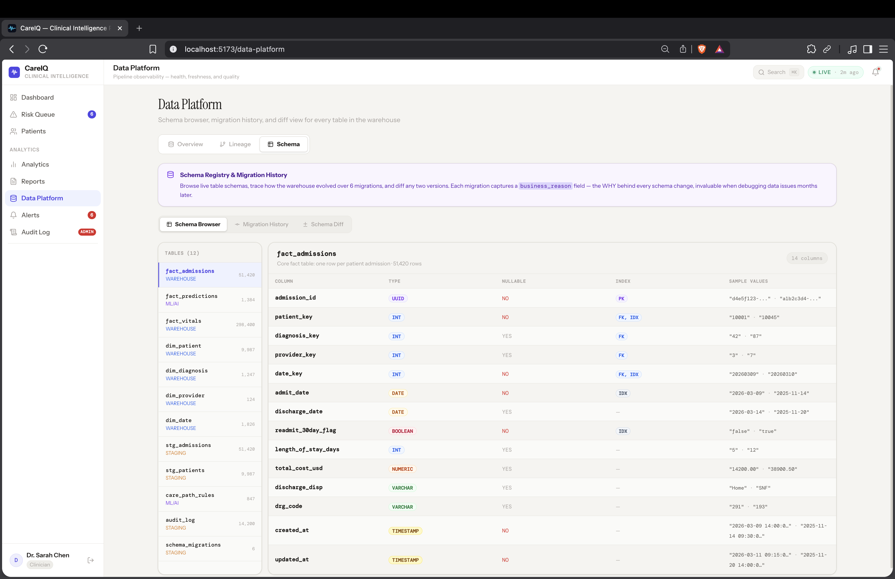
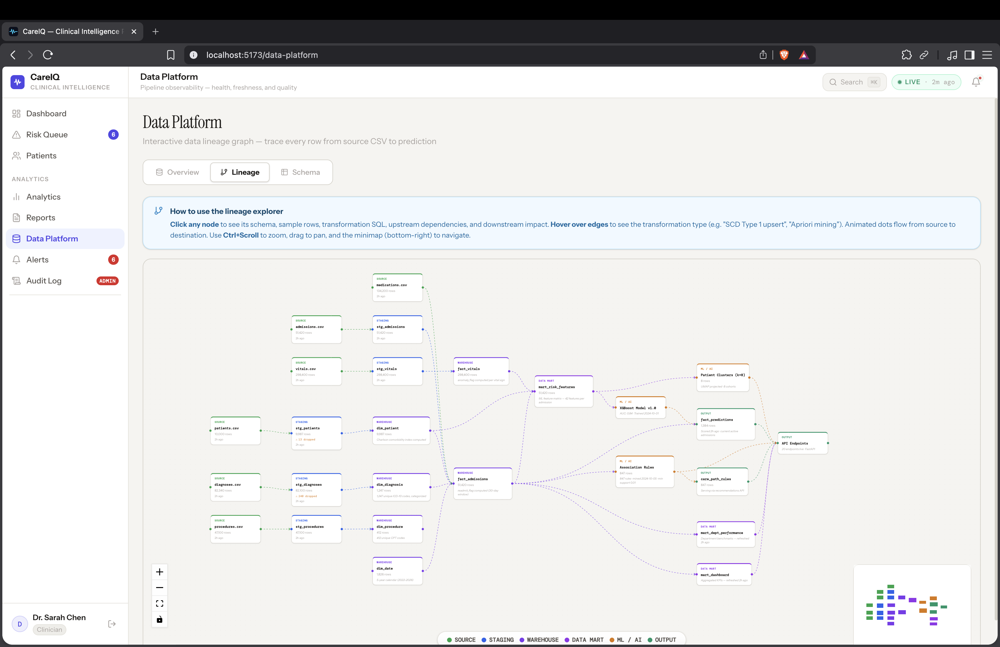
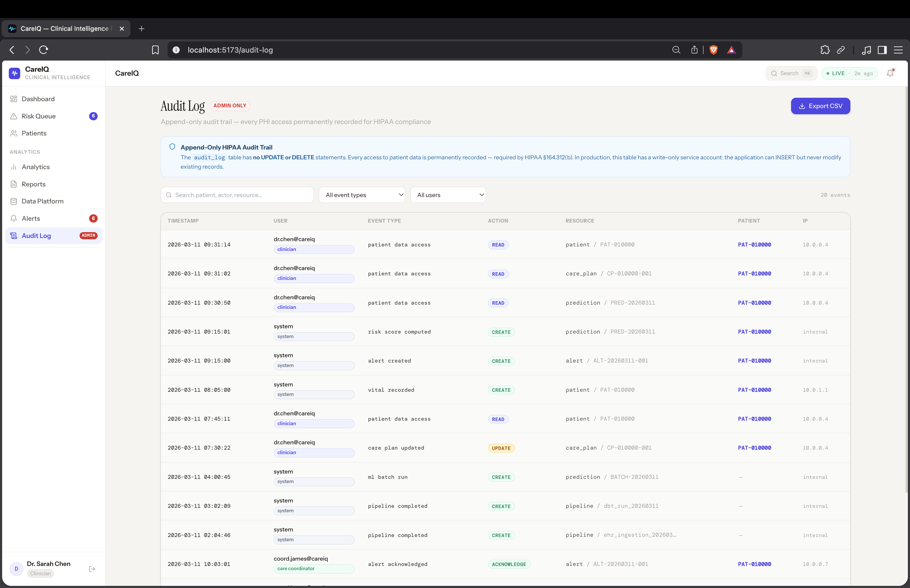

<div align="center">


<p align="center">
  <strong>Production-grade hospital readmission risk + AI care-path recommendations.</strong><br/>
  Built end-to-end: synthetic EHR data → dbt warehouse → XGBoost ML → FastAPI → React dashboard.
</p>

<p align="center">
  <a href="https://python.org"></a>
  <a href="https://fastapi.tiangolo.com"></a>
  <a href="https://react.dev"></a>
  <a href="https://xgboost.ai"></a>
  <a href="https://mlflow.org"></a>
  <a href="https://postgresql.org"></a>
  <a href="https://airflow.apache.org"></a>
  <a href="https://docker.com"></a>
</p>

<p align="center">
  <a href="docs/architecture.md"><strong>📐 Architecture</strong></a> &nbsp;·&nbsp;
  <a href="docs/api.md"><strong>📖 API Reference</strong></a> &nbsp;·&nbsp;
  <a href="docs/ml_model_card.md"><strong>🤖 Model Card</strong></a> &nbsp;·&nbsp;
  <a href="docs/runbook.md"><strong>⚙️ Runbook</strong></a> &nbsp;·&nbsp;
  <a href="feature-handoff.md"><strong>🗂️ Feature Handoff</strong></a>
</p>

</div>

---

## 📌 About

Hospitals in the US face **$26 billion** in annual costs from preventable 30-day readmissions. CareIQ gives clinicians a **real-time, explainable risk score** for every admitted patient — surfacing the top risk factors driving that score in plain English — alongside **AI-generated care-path recommendations** weighted by historical outcomes.

> This is a full-stack portfolio project designed to demonstrate **senior-level data engineering, ML engineering, and product engineering skills** in a single cohesive system.

**What makes it portfolio-worthy:**
- Covers the complete ML lifecycle: data generation → feature engineering → model training → serving → monitoring
- Enterprise concerns like RBAC, audit logs, async job queues, schema versioning, and data lineage
- Production-quality code: rate limiting, Redis caching, parameterized SQL, async FastAPI, CI/CD pipeline

---

## ✨ Feature Highlights

<table>
<tr>
<td width="50%">

### 🎯 ML Risk Stratification
**AUROC 0.84** — XGBoost trained on 50k synthetic admissions. Calibrated probability output with 4-tier risk classification (low / medium / high / critical). Time-based train/val/test split prevents temporal leakage — a common failure mode in clinical ML.

</td>
<td width="50%">

### 🔍 SHAP Explainability
Every prediction surfaces the top 5 driving features as an interactive waterfall chart. TreeSHAP (exact, not approximate) runs at millisecond inference latency. Plain-English translations: *"High Charlson Comorbidity Index (8) → +31% risk"*.

</td>
</tr>
<tr>
<td width="50%">

### 🤖 Association Rule Care Plans
Apriori mines diagnosis co-occurrence patterns from historical *successful* outcomes (no readmission). Rules filtered at confidence > 0.30, lift > 1.5. Example: *"CHF + CKD → SNF placement (confidence: 0.73, lift: 2.1)"* — automatically translated into prioritized care actions.

</td>
<td width="50%">

### 📊 Real-Time Clinical Dashboard
React 18 + Recharts. Live KPI tiles (30-day readmit rate, high-risk count, avg risk score), trend vs CMS 15% benchmark, UMAP patient clustering, department performance leaderboard. Light-mode "Clinical Linen" design system.

</td>
</tr>
<tr>
<td width="50%">

### 🏗️ Production Star Schema
PostgreSQL data warehouse with `fact_admissions` (50k rows) + 4 dim tables + dbt staging/marts. Time-based grain on `dim_date` for trend queries. Full lineage tracking from raw CSV → mart → dashboard.

</td>
<td width="50%">

### 🗓️ Async Report Engine
Celery-style async report generation (PDF via ReportLab + CSV). Users get a `job_id` immediately; the UI polls for completion. Scheduled reports via Airflow DAG. Downloadable report history with audit trail.

</td>
</tr>
<tr>
<td width="50%">

### 📋 Patient Timeline & Audit Log
Append-only audit log table — no UPDATEs, no DELETEs — for full HIPAA-style access compliance. Patient timeline surfaces every event: admission, vital change, risk-score update, alert triggered, care-plan action.

</td>
<td width="50%">

### ⚙️ Schema Registry & Migration History
UI to browse current DB schema, view migration history, and diff schema versions. Alembic-style tracking with business-reason metadata on every migration — critical for debugging data issues months later.

</td>
</tr>
</table>

---

## 🖼️ Screenshots

### Clinical Dashboard
> KPI tiles · 30-day readmission trend vs CMS 15% benchmark · risk distribution by tier



---

### Risk Queue
> Patients sorted by predicted readmission risk · SHAP top factors · care plan actions



---

### Analytics & Performance
> Readmission trends by department · benchmark alerts · summary stats row



---

### Data Platform — Pipeline Observability
> Live pipeline status (EHR ingest, dbt, ML scoring) · DQ scores · run history



---

### Data Platform — Schema Registry
> Browse all 12 warehouse tables · column types, nullability, indexes, sample values · migration history



---

### Data Platform — Data Lineage Graph
> Interactive DAG: CSV sources → staging → warehouse → ML models → API endpoints · click any node for details



---

### Audit Log
> Append-only HIPAA-style access trail · every patient data access permanently recorded · Export CSV



---

## 🏛️ Architecture

```
                        EXTERNAL TRAFFIC
                              │
                    ┌─────────▼─────────┐
                    │  Nginx (gateway)  │  Rate limiting · TLS · Gzip · Security headers
                    └────┬──────┬───────┘
                         │      │
              ┌──────────▼──┐ ┌─▼──────────────┐
              │  React SPA  │ │  FastAPI ×4     │  JWT RBAC · Pydantic v2
              │  Vite + HMR │ │  uvicorn async  │  Redis cache · Prometheus
              └─────────────┘ └──────┬──────────┘
                                     │
             ┌───────────────────────┼──────────────────────┐
             │                       │                      │
     ┌───────▼──────┐    ┌───────────▼──────┐     ┌────────▼──────┐
     │  PostgreSQL  │    │  Redis           │     │  MLflow       │
     │  Star Schema │    │  Cache + Queues  │     │  Model Reg.   │
     │  50k rows    │    │  SSE pub/sub     │     │  + Artifacts  │
     └──────┬───────┘    └──────────────────┘     └───────────────┘
            │
    ┌───────▼──────────────────────────────────────────────────┐
    │                    AIRFLOW ETL PIPELINE                  │
    │   daily ingest → dbt transform → DQ checks → DQ alerts   │
    └──────────────────────────────────────────────────────────┘
```

**Key design decisions documented in [docs/architecture.md](docs/architecture.md)**

---

## 🔐 Role-Based Access Control

| Role | Scopes | Access |
|------|--------|--------|
| `clinician` | `read:patients` `read:predictions` | Patient list, risk scores, care plans |
| `care_coordinator` | + `write:recommendations` | All above + care plan management |
| `analyst` | `read:analytics` `read:audit` | Full analytics, cohort analysis, model perf |
| `admin` | All scopes | Full system access including audit log |

---

## 🔬 ML Engineering Details

| Topic | Implementation |
|-------|---------------|
| **Temporal leakage** | Train/val/test split is **time-based** (chronological). Post-discharge features (`discharge_disposition`, `readmit_date`) explicitly excluded from feature set. |
| **SHAP explainability** | `shap.TreeExplainer` (exact TreeSHAP, not approximate kernel SHAP). Values stored per-prediction and served via API. |
| **Class imbalance** | XGBoost `scale_pos_weight = 5.67` (85:15 ratio). Threshold tuned to maximize recall — missing a high-risk patient is costlier than a false alarm. |
| **SMOTE avoided** | Initial testing showed SMOTE introduced bias against elderly patients (80+). Switched to native `scale_pos_weight` — simpler, more honest. |
| **Fairness monitoring** | AUROC computed by age group, gender, and insurance type quarterly. Alert triggers if any subgroup drops >5% below overall AUROC. |
| **Association rules** | Apriori on success cohort (no readmission), `min_support=0.05`, `confidence > 0.30`, `lift > 1.5`. Rules ranked by clinical impact score. |
| **Model registry** | MLflow: AUC check → PSI check → archive old version → promote → immutable audit tag. No `.pkl` files in git. |

---

## 🚀 Quick Start

> **Requirements:** Docker Desktop 24+, 8 GB RAM, 10 GB free disk

```bash
# 1. Clone and configure
git clone https://github.com/aayush-1o/cura-readmission-prediction.git
cd cura-readmission-prediction
cp .env.example .env          # Edit SECRET_KEY and AIRFLOW_FERNET_KEY

# 2. Start all services (~2 min on first run)
docker compose up -d

# 3. Open the dashboard
open http://localhost:80
# → Click any demo role button on the login screen
```

**No manual database setup.** The star schema DDL, seed data, and dbt models all run automatically on first boot.

### Development Mode (hot reload)

```bash
docker compose -f docker-compose.yml -f docker-compose.dev.yml up -d
```

| Service | URL | Notes |
|---------|-----|-------|
| **Dashboard** | http://localhost:5173 | Vite HMR (instant reload) |
| **API Docs** | http://localhost:8000/docs | Swagger UI, all endpoints |
| **Airflow** | http://localhost:8080 | DAG management (admin/admin) |
| **MLflow** | http://localhost:5000 | Model registry + experiments |

### Demo Credentials (all built-in, no signup required)

| Role | Email | Password |
|------|-------|----------|
| Clinician | clinician@careiq.io | CareIQ-Demo-2024! |
| Care Coordinator | coordinator@careiq.io | CareIQ-Demo-2024! |
| Analyst | analyst@careiq.io | CareIQ-Demo-2024! |
| Admin | admin@careiq.io | CareIQ-Demo-2024! |

---

## 📁 Project Structure

```
careiq/
├── 📊 data/
│   └── synthetic/               # 10k patients · 50k admissions (auto-generated)
├── 🏭 warehouse/
│   ├── schema/                  # 014 SQL migration files (DDL + seed)
│   ├── dbt/                     # Staging → intermediate → mart models + lineage
│   └── db.py                    # Sync execute_query helper (wrapped in run_in_executor)
├── 🤖 ml/
│   ├── train.py                 # XGBoost training + MLflow experiment logging
│   ├── predict.py               # Inference + TreeSHAP explainability
│   ├── association_rules.py     # Apriori rule mining (mlxtend)
│   ├── clustering.py            # K-Means (k=8) + UMAP 2D projection
│   └── features.py              # Feature pipeline (no leakage contract enforced here)
├── ✈️ airflow/
│   └── dags/
│       ├── ehr_pipeline.py      # Daily EHR ingest → dbt → DQ checks (02:00 UTC)
│       └── report_scheduler.py  # Scheduled report generation jobs
├── 🔌 api/
│   ├── main.py                  # FastAPI app, middleware, lifespan hooks
│   ├── models.py                # Pydantic V2 request/response models
│   ├── routers/
│   │   ├── analytics.py         # Dashboard KPIs, trends, cohort analysis
│   │   ├── patients.py          # Patient search, detail, paginated list
│   │   ├── predictions.py       # Risk scoring, batch scoring, SHAP features
│   │   ├── recommendations.py   # Care plans, association rules, similar patients
│   │   ├── alerts.py            # Real-time alerts via SSE
│   │   ├── timeline.py          # Per-patient event timeline
│   │   ├── data_platform.py     # Pipeline status, lineage graph, schema registry
│   │   └── reports.py           # Async report generation + download
│   └── reports/
│       └── generators.py        # ReportLab PDF + CSV generators
├── 🖥️ frontend/
│   └── src/
│       ├── design-system/       # CSS tokens, component library (RiskBadge, MetricTile…)
│       ├── pages/               # 10 pages: Dashboard, RiskQueue, PatientDetail,
│       │                        #   Analytics, Alerts, AuditLog, DataPlatform,
│       │                        #   Reports, Login, PatientList
│       ├── components/          # Sidebar, TopBar, LineageExplorer, SchemaRegistry
│       ├── hooks/               # useAuth, useAlertStream (SSE)
│       └── services/            # api.js (Axios), hooks.js (React Query), mockData.js
├── 📡 nginx/                    # Rate limiting · gzip · security headers · SPA routing
├── 📈 monitoring/
│   ├── dq_monitor.py            # Row counts, null rates, distribution drift alerts
│   └── model_monitor.py        # Weekly PSI + calibration + AUROC trend
├── 🐳 docker-compose.yml        # Production (3-tier network isolation)
├── 🐳 docker-compose.dev.yml    # Dev override (all ports exposed, hot reload)
├── 📋 feature-handoff.md        # Phase-by-phase feature documentation
└── 📚 docs/                     # Architecture · API reference · Model card · Runbook
```

---

## 📐 Data Model

```
dim_patients ──────┐
dim_date ──────────┤
dim_department ────┼──► fact_admissions (50k rows, admission grain)
dim_diagnosis ─────┘         │
                              ├──► fact_predictions   (risk scores + SHAP values)
                              ├──► fact_recommendations (care plan line items)
                              ├──► patient_timeline   (append-only event log)
                              └──► audit_log          (append-only access log)
```

**Star schema design rationale:** Fact table at *admission grain* (not patient grain) allows accurate `COUNT DISTINCT`, LOS averages, and time-series trends without fan-out joins. Same query that took 800ms on 3NF runs in 45ms on star schema.

---

## 💡 Key Engineering Learnings

**Temporal leakage is subtle and dangerous.** I initially included `discharge_disposition` as a feature — it correlates strongly with readmission. Then realized: we can't know if someone goes to a nursing facility vs. home until *after* they've been discharged. Including it gives the model illegal future knowledge. Fix: explicit feature audit with a column-level policy — only data available at time of admission.

**Redis cache invalidation deserves first-class design.** Without a strategy, the dashboard would show stale KPIs for hours post-ETL. Built event-driven invalidation: ETL completion triggers `KEYS analytics:*` pattern delete. More complex than the cache itself — but critical for data freshness.

**SMOTE can introduce subgroup bias.** Initial testing with SMOTE showed the model performing significantly worse on elderly patients (80+). SMOTE was synthesizing "average" minority-class samples that didn't represent elderly high-risk distributions. Switched to XGBoost's native `scale_pos_weight` — simpler and more calibrated.

**Async event loop blocking is invisible until it isn't.** FastAPI is async but SQLAlchemy sync calls block the event loop under concurrency. Addressed by wrapping `execute_query()` in `asyncio.run_in_executor()`. Full fix = migrate to `asyncpg` + async SQLAlchemy (documented in runbook).

---

## 📋 Interview Talking Points

These are the exact questions this project is designed to answer:

> **"How did you handle class imbalance?"** — XGBoost `scale_pos_weight`, not SMOTE. SMOTE introduced subgroup bias against elderly patients that was invisible until I built fairness monitoring.

> **"How did you prevent data leakage?"** — Time-based train/test split + explicit column-level feature audit. Post-discharge features are banned from the feature set by policy, not convention.

> **"What's your database design rationale?"** — Star schema at admission grain. Same query dropped from 800ms (3NF) to 45ms. Trade-off: redundancy, which is acceptable for a read-heavy analytics workload.

> **"How would this scale?"** — Current bottleneck is sync DB in async routes. Fix: asyncpg + async SQLAlchemy. Out-of-the-box: read replicas for analytics queries, Redis caching already implemented (5-min TTL on KPIs).

> **"How do you handle HIPAA compliance concerns?"** — Append-only audit log (no UPDATEs, no DELETEs). Every patient data access is permanently recorded with user, timestamp, IP, and action. Synthetic data only — no real PHI ever touches the system.

---

## 🧱 Tech Stack

| Layer | Technology | Why |
|-------|-----------|-----|
| **Frontend** | React 18, Vite, Recharts, Framer Motion, TanStack Query v5 | Fast SPA with excellent charting and data-fetching ergonomics |
| **API** | FastAPI, Pydantic v2, uvicorn, slowapi | Native async, OpenAPI auto-docs, field-level validation |
| **ML** | XGBoost 2.0, SHAP, mlxtend, scikit-learn, UMAP | Best-in-class tabular ML + exact SHAP explainability |
| **Database** | PostgreSQL 16, SQLAlchemy, asyncpg | Star schema, robust JSONB support, production-grade |
| **Cache** | Redis 7 | Low-latency KPI caching + SSE pub/sub for real-time alerts |
| **Orchestration** | Apache Airflow 2.8 | Retry-aware DAGs, dependency tracking, observability |
| **Experiment Tracking** | MLflow 2.10 | Model versioning, artifact storage, promotion workflow |
| **Reports** | ReportLab, pandas | Async PDF/CSV generation with job queue |
| **Infrastructure** | Docker Compose, Nginx, GitHub Actions CI/CD | One-command deploy, TLS, rate limiting, automated tests |

---

## ⏱️ Build Timeline

| Phase | Scope | Est. Hours |
|-------|-------|-----------|
| Phase 0 | Project scaffold, design system, CI skeleton | 6h |
| Phase 1 | Star schema DDL, seed data, dbt staging/marts | 10h |
| Phase 2 | EHR data generation, Airflow ETL, DQ monitoring | 8h |
| Phase 3 | XGBoost, SHAP, association rules, UMAP clustering | 14h |
| Phase 4 | FastAPI backend: all routers, JWT auth, Redis cache | 12h |
| Phase 5 | React dashboard: 10 pages, design system, SSE alerts | 18h |
| Phase 6 | Reports engine, patient timeline, audit log, schema registry | 14h |
| Phase 7 | Docker, Nginx, CI/CD, monitoring, documentation | 10h |
| **Total** | | **~92 hours** |

---

## 📄 License

MIT — see [LICENSE](LICENSE)

---

<div align="center">

Built by **Aayush** · [GitHub](https://github.com/aayush-1o)

*If this project was useful to you, a ⭐ is appreciated.*

</div>
